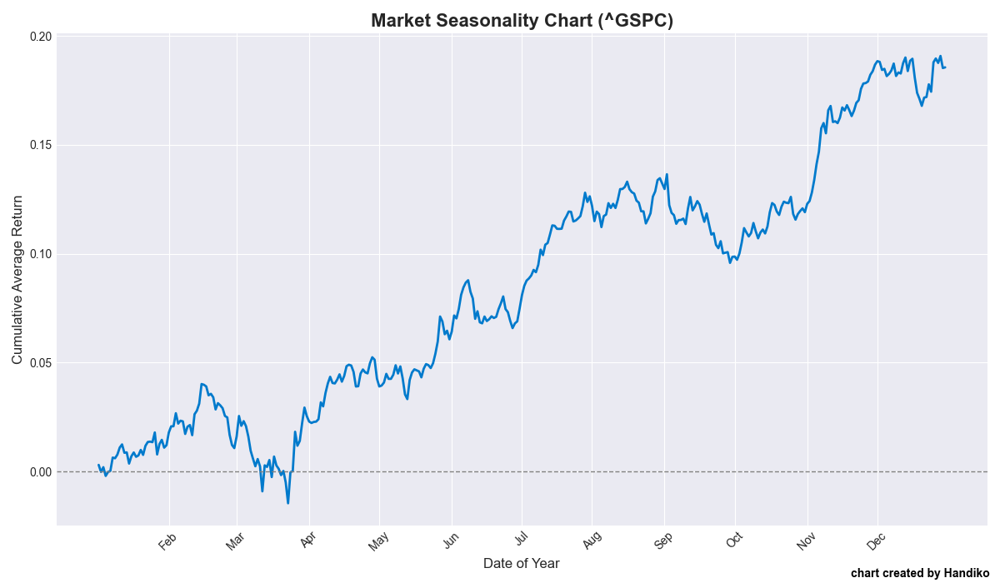

# Market Seasonality Chart Generator
Generating "Market Seasonality" Chart for Any Market listed on Yahoo Finance.

## Background
For effective analysis and the development of seasonal trading strategies, it is often necessary to have a historical average return for the month. By independently generating this data, we gain a deeper understanding of the underlying mechanics, which allows us to customize the historical period to suit our specific analytical or strategic requirements.

## How The Chart is Calculated
This is a cumulative average return chart. It's calculated by first finding the average daily return for each specific day of the year over the last decade. These daily averages are then accumulated to create the plotted line. That's it! That's simple!

Code : [here](https://github.com/handiko/Market-Seasonality-Chart-Generator/blob/main/PythonScript/market_seasonality.py)

## How to Use
Simply pass the ticker symbol (Yahoo Finance ticker consensus) and duration as the arguments:
```python
python market_seasonality.py --ticker AAPL --years 10
```

---
## Examples
### S&P 500 Index



### Russell 200 Index


### Nasdaq Futures


### Gold Contract Futures


### EURUSD


### USDJPY


### Bitcoin


### IDX COMPOSITE Index


---

## Related Project
[Monthly Seasonality Trading Strategy Backtest](https://github.com/handiko/Monthly-Seasonality-Trading-Strategy-Backtest/blob/main/README.md)

---

Back to [Index](https://github.com/handiko/handiko/blob/master/README.md)
