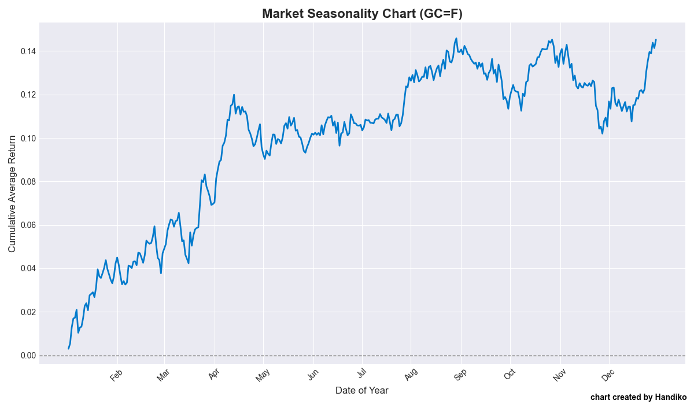

# Market Seasonality Chart Generator
Generating "Market Seasonality" Chart for Any Market listed on Yahoo Finance.

## Background
Sometimes, we need some kind of "hint" or historical average return for the month. This could be used for further analysis or creating a seasonal trading/investing strategy. By creating the chart ourselves, we could understand the mechanics of how the chart is calculated, and we can tweak or adjust the historical length to our needs.

## How The Chart is Calculated
The chart is basically a cumulative average return chart. The chart describes the average daily return for each unique day of the year for the last 10 years. The average daily return was then accumulated and plotted into a chart. That's it! That's simple!

---
## Examples
### Nasdaq Futures

### Gold Contract Futures

### EURUSD

### USDJPY

### Bitcoin

### Jakarta Stock Exchange COMPOSITE Index

### US Dollar Index

---
